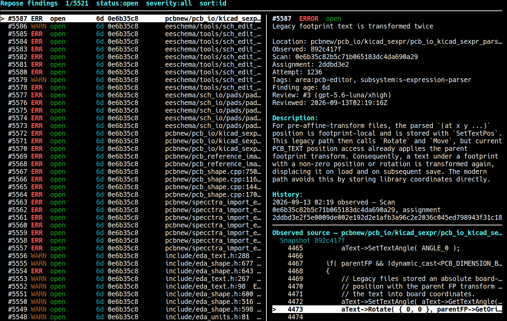

# Repose - Whole Codebase AI Reviewer

## WARNING

This is the only human-written text or code in this whole project. You have been
warned. I have not reviewed the code, nor do I intend to. I have tested this only
for my own use cases. 




## Overview

Repose is a local AI reviewer for a complete snapshot of a large C/C++
codebase. It inventories the repository, uses clangd to map symbols and include
relationships, divides the code into bounded review assignments, and runs those
assignments in parallel. Findings and model attempts are saved so an audit can
be stopped, inspected, and resumed over days.

Repose is forked from AIR. AIR follows a stream of landed commits; Repose reviews
one stable checkout at one commit and does not determine when a problem was
introduced. Each finding records the commit where it was observed, and later
recheck passes can verify saved findings with a different model without replacing
the original result.

Repose is focused on C/C++ repositories. It expects a CMake compilation database
and supports semantic indexing with clangd 21 or newer. Codex is the default
review harness; already authenticated Claude Code and Gemini CLIs are also
supported.

Use Repose from the command line, browse inventories and findings in its terminal
interfaces, or export findings as JSON, SARIF, or a self-contained HTML report.

## Quick start

Use a dedicated scan checkout, separate from your development tree, and keep it
unchanged for the duration of the audit. Run the following commands from the
root of that checkout. Configure its build with
`-DCMAKE_EXPORT_COMPILE_COMMANDS=ON`; Repose looks for
`build/compile_commands.json` by default.

Build the inventory, review its scope, and index it:

```bash
repose inventory build
repose inventory browse
repose inventory index --jobs 8
repose inventory list
repose inventory approve INVENTORY_ID
```

The inventory browser can exclude QA or other out-of-scope trees, add groups,
tags, and notes, and preview the assignments that a scan will use. Copy
the current `INVENTORY_ID` from `inventory list` after you finish curating it.

Create a frozen scan, inspect a prompt, and run its assignments:

```bash
repose scan create --model gpt-5.6-luna --effort xhigh
repose scan prompt SCAN_ID 1
repose scan run SCAN_ID --jobs 8
repose findings --scan SCAN_ID
```

`scan create` makes no model calls. It freezes the inventory, observed commit,
scope, model settings, reviewer guidance, assignments, and exact prompts. Copy
`SCAN_ID` from its output. Interrupted scans resume without repeating completed
assignments:

```bash
repose scan resume SCAN_ID --jobs 8
```

Use `--limit` to run a bounded batch, such as 32 assignments across 32 workers:

```bash
repose scan run SCAN_ID --jobs 32 --limit 32
```

Recheck findings from the latest completed scan with another model, or export
them for review outside Repose:

```bash
repose recheck --model gpt-5.6-sol --effort xhigh --jobs 8 --batch-max 5
repose export --format html -o findings.html
```

Repose records the Git author and blamed-commit age of each finding's exact
source line. Databases created before line attribution can fill existing
findings without rerunning the scan; the command is resumable and groups blame
work by file:

```bash
repose finding backfill-authors --jobs 8
```

Related findings can be grouped into durable fixes and applied sequentially to
a separate development checkout. The finding TUI uses `f` to create a new fix
from the selected finding and `F` to add the selection to the newest pending
fix. The CLI creates a fix from an ordered list; delete and recreate a pending
fix to change that list:

```bash
repose fix create 123 456 789
repose fix list
repose fix run --worktree ../development-checkout --model gpt-5.6-sol --effort xhigh
```

Each fix is one Codex call, and `fix run` handles entries one at a time in queue
order. Repose retains attempts and token usage, does not commit changes, and
does not mark findings resolved. A model-process failure stops the queue so the
development checkout can be inspected before `--retry-failed`.

Run `repose status` for current progress, `repose doctor` for a read-only health
check, `repose help` or `repose COMMAND --help` for command documentation, and
`man repose` for the complete reference. The
[design notes](docs/repose-design.md) and
[semantic indexing notes](docs/semantic-inventory.md) describe the saved-state
and clangd contracts in more detail.

## Build requirements

- Go 1.26 or newer
- Git
- A C compiler for SQLite

Semantic indexing additionally requires clangd 21 or newer. Running a scan
requires an installed and authenticated Codex, Claude Code, or Gemini CLI.

## Build and install

```bash
make
make test
sudo make install
```

This installs the `repose` executable and its manual page under `/usr/local`.
Set `PREFIX` to choose another installation prefix, or use `DESTDIR` for a staged
installation.

## License

Repose is licensed under the [GNU Affero General Public License, version 3](LICENSE)
(`AGPL-3.0-only`).
